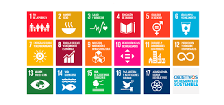

# Introducción a la Sostenibilidad

La sostenibilidad es la capacidad de satisfacer las necesidades presentes sin comprometer la capacidad de las futuras generaciones para satisfacer las suyas, buscando un equilibrio entre el medio ambiente, la sociedad y la economía.

- Ambiental
- Social
- Económica

> "El desarrollo sostenible es el desarrollo que satisface las necesidades del presente sin comprometer la capacidad de las futuras generaciones para satisfacer sus propias necesidades."  
> — Comisión Mundial sobre el Medio Ambiente y el Desarrollo (Informe Brundtland, 1987)

| ODS                  | Descripción                           | Relación con Informática                |
|----------------------|-------------------------------------|---------------------------------------|
| ODS 9: Industria, innovación e infraestructura | Fomentar la innovación tecnológica. | Desarrollo de tecnologías sostenibles.|
| ODS 12: Producción y consumo responsables    | Uso eficiente de los recursos.     | Optimización de recursos en TI.       |
| ODS 13: Acción por el clima                   | Medidas contra el cambio climático.| Reducción de la huella de carbono digital.|

* [x] Utilizar energía renovable en centros de datos  
* [ ] Implementar políticas de reciclaje de hardware  
* [x] Promover el teletrabajo para reducir desplazamientos  

